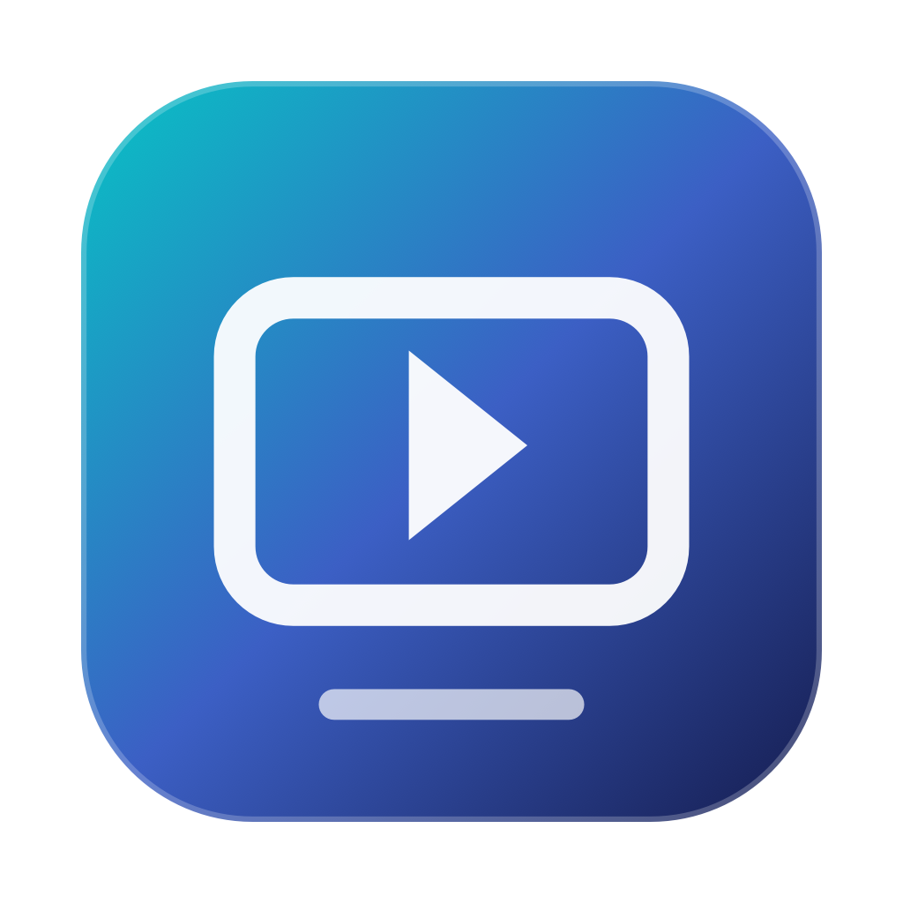

# Video Screen Saver Generator


Video Screen Saver Generator is a native macOS utility that turns a local video into an installable `.saver` screen saver. It keeps the validated v3.1 Objective-C screen-saver engine while providing a polished SwiftUI workflow for choosing, previewing, configuring, exporting, and installing videos.

<p align="center">
  
</p>

## Features

- Native SwiftUI macOS interface with Create and Settings pages.
- Native macOS top bar and sidebar with English, Simplified Chinese, and Traditional Chinese language switching.
- Choose a movie with the native file picker or drag it onto the preview surface.
- Looping in-app preview with immediate mute control and graceful metadata loading.
- Fill or Fit display mode, configurable screen saver name, and Unicode-safe bundle identifiers.
- Export `.saver` or generate and install into `~/Library/Screen Savers`.
- Export/signing work runs away from the UI thread with indeterminate busy feedback.
- Generated screen savers embed the video, so the original file can be moved or deleted afterward.
- Generated bundles are xattr-cleaned and ad-hoc signed without modifying the original source video.
- Universal 2 (`arm64` + `x86_64`) app and screen saver.
- Appearance settings for accent color and Enhanced / Reduced / Off motion, respecting Reduce Motion.
- Latency Graph-style 16-color accent selection, vertical page switching, startup/component reveals, and runtime-aware motion optimization.

The screen saver remains a conservative legacy `ScreenSaverView` bundle implemented in Objective-C with `AVQueuePlayer`, `AVPlayerLooper`, and `AVPlayerLayer`. It preserves the dedicated `legacyScreenSaver` lifecycle workaround and never exits the app, System Settings preview, or smoke-test host.

## Requirements

- macOS 15 or newer
- Full Xcode with the macOS SDK and command-line tools
- Apple Silicon or Intel Mac

Launch Xcode once so the SDK and license are available before building.

## Build and verification

Run the complete three-pass validation build:

```sh
./build.command
```

The default output is `~/Desktop/Video Screen Saver Generator Build/`. For CI or release automation, avoid opening Finder and the interactive pause:

```sh
VIDEO_SCREEN_SAVER_VERSION=1.0.4 \
VIDEO_SCREEN_SAVER_BUILD_VERSION=5 \
VIDEO_SAVER_BUILD_OUTPUT=/tmp/video-screen-saver-generator-build \
./build.command --no-open --non-interactive
```

The passes verify:

1. Plists, deterministic parsing of every Swift app source, Objective-C SDK syntax, the principal class, xattr cleanup, and architecture boundaries.
2. Universal 2 app and saver binaries, bundle structure, linked frameworks, exported `VideoScreenSaverView`, and strict code signatures.
3. A generated saver containing `TestAssets/smoke.mp4`, the extended-attribute signing regression, `NSBundle` loading, preview/full instantiation, and start/stop lifecycle.

Use `diagnose.command` from the build output to collect recent screen saver logs without copying the source video.

## Release packaging

Generate the app icon and the complete release set with:

```sh
./Scripts/release.sh
```

The release flow runs validation, builds Universal 2, constructs a clean app bundle, performs generated-artifact metadata cleanup, ad-hoc signs and strictly verifies the app and saver, creates a clean-app ZIP and compressed UDZO DMG, checks the DMG topology, writes SHA-256 sidecars, and creates a source archive.

Release artifacts are written to `dist/` using this naming pattern:

```text
macOS-Video-Screen-Saver-Generator-v<VERSION>-macOS-universal.app
macOS-Video-Screen-Saver-Generator-v<VERSION>-macOS-universal.zip
macOS-Video-Screen-Saver-Generator-v<VERSION>-macOS-universal.dmg
macOS-Video-Screen-Saver-Generator-v<VERSION>-source.zip
```

The DMG contains exactly:

```text
Video Screen Saver Generator.app
Applications -> /Applications
```

Signing is intentionally ad-hoc for local use. Release metadata reports `signed: false` and `notarized: false`; the artifacts are not Developer ID signed or notarized.

To regenerate the app icon independently:

```sh
./Scripts/generate-app-icon.swift
```

This creates the full AppKit-generated `Resources/AppIcon.iconset`, `Resources/AppIcon.icns`, and `Resources/AppIcon.png` preview.

## Export behavior and source safety

When exporting, the app validates the source, copies the embedded template into a staging `.saver`, removes old `video.*` resources, copies the selected video, writes `SaverConfig.plist`, rewrites generated metadata, recursively clears xattrs from the generated staging bundle only, removes the stale signature, signs, verifies, and finally moves the staging bundle to the destination.

The user's original video is never xattr-cleaned, moved, transcoded, or overwritten. If signing or verification fails, the Create page provides a concise summary plus expandable, copyable technical diagnostics containing the subprocess exit code and captured stdout/stderr.

## Repository layout

```text
Sources/App/                  SwiftUI shell, workflow, preview, metadata, design system
Sources/ScreenSaver/          Objective-C ScreenSaver.framework implementation
Sources/SmokeTest/            Generated saver runtime smoke host
Resources/                    App/saver plists and generated app icon
Scripts/                      Universal packaging, DMG, architecture, icon, and release tooling
TestAssets/                   Small deterministic smoke-test video
```

## Release

Download the latest Universal 2 app, ZIP, DMG, and source archive from [GitHub Releases](https://github.com/HanBangyuan8/macOS-Video-Screen-Saver-Generator/releases).

Release notes are maintained in [`CHANGELOG.md`](CHANGELOG.md). The release pipeline uses ad-hoc signing for local distribution; it does not claim Developer ID signing or notarization.

## License

MPL-2.0. See [`LICENSE`](LICENSE).

## Star History

<a href="https://www.star-history.com/?type=date&repos=HanBangyuan8%2FmacOS-Video-Screen-Saver-Generator">
 <picture>
   <source media="(prefers-color-scheme: dark)" srcset="https://api.star-history.com/chart?repos=HanBangyuan8/macOS-Video-Screen-Saver-Generator&type=date&theme=dark&legend=top-left" />
   <source media="(prefers-color-scheme: light)" srcset="https://api.star-history.com/chart?repos=HanBangyuan8/macOS-Video-Screen-Saver-Generator&type=date&legend=top-left" />
   
 </picture>
</a>
